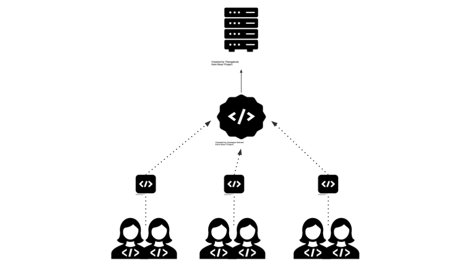
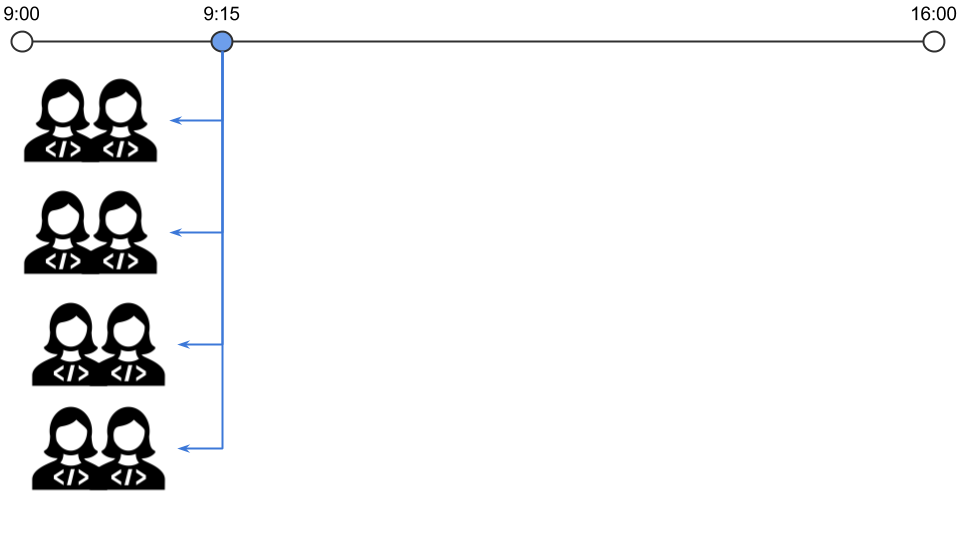
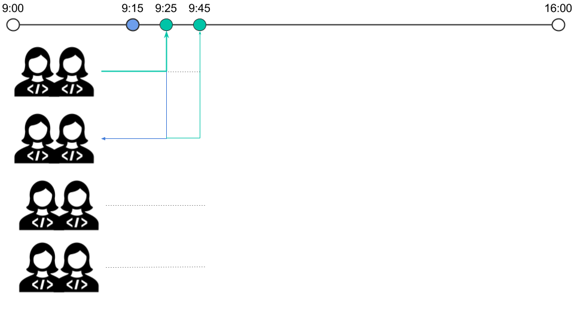
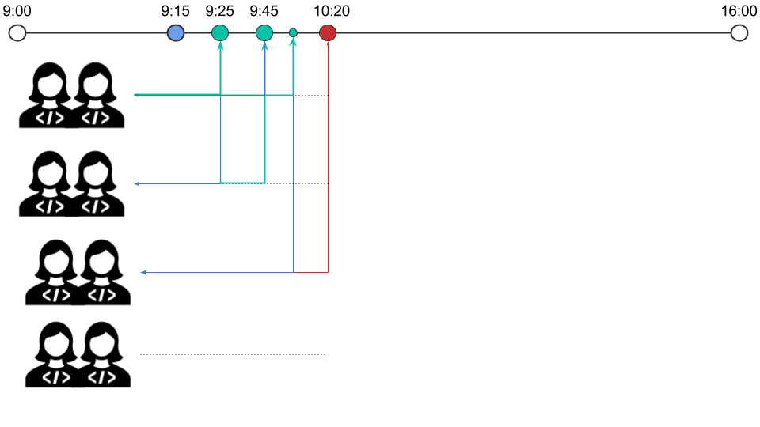
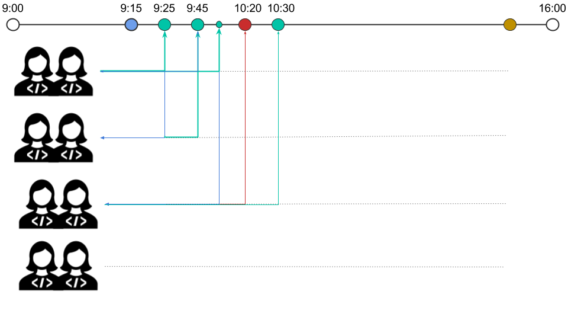

# Integração e Entrega Contínua

----

<h2 class="spaced-text">Como se faz software?</h2>

----

<h3 class="spaced-text" style="text-align:left">Rotina</h3>

  <ul>
    <li> Escrevemos <b class="green">CÓDIGO</b> </li>
    <li> Trabalhamos em <b class="green">TIME</b> </li>
    <li> Cada par trabalha em uma parte</li>
    <li> <b class="green">TESTAMOS</b> nosso código</li>
    <li> O trabalho de cada par precisa  ser <b class="green">INTEGRADO</b> </li>
    <li> Tá consistente? Vai pra aprovação do PO </li>
    <li> PO aprovou? Vai pra <b class="green">PRODUÇÃO</b></li>
  </ul>

----

<h3 class="spaced-text" style="text-align:left">O que é produção?</h3>

----

<h3 class="spaced-text" style="text-align:left">Caminho para produção</h3>

----

<h3 class="spaced-text" style="text-align:left">ANTIGAMENTE</h3>

  <ul>
    <li> <b class="yellow">FTP</b> </li>
    <li> projeto-backup.old.rar </li>
    <li> projeto-backup1.old.rar </li>
    <li> Alguém tinha que ser o GIT humano </li>
    <li> Testes manuais </li>
    <li> "Vamos pra produção no fim de semana..." </li>
  </ul>

----

<h3 class="spaced-text" style="text-align:left">Evoluindo</h3>

  <ul>
    <li> Ferramentas de versão de controle </li>
    <li> Testes automatizados </li>
    <li> Automatização de deployments </li>
    <li> Automatização de infraestrutura </li>
  </ul>

----

----

### Integração Contínua

----

É uma técnica utilizada por times de desenvolvimento para garantir a
construção distribuída de software de maneira consistente e simples.

----

Integrar várias vezes ao dia

----

Validar toda vez que integrar

----

“A integração contínua não elimina os bugs, porém, ela os torna drasticamente mais fáceis de encontrar e corrigir."

\- Martin Fowler

----

### Por que usar?

<ul>
  <li>Maior integridade do que está sendo construído</li>
  <li>Feedbacks mais rápidos sobre o que está errado</li>
  <li>Mais fácil traçar um caminho para produção</li>
  <li>Mais qualidade e velocidade nas entregas</li>
</ul>

----

### Práticas

<ul style="float:left">
  <li>✅ Repositório único de código </li>
  <li>✅ Automatizar o build </li>
  <li>✅ Todo commit deve passar pela bateria de testes </li>
  <li>✅ Manter o build rápido </li>
  <li>Ambiente de testes muito próximo ao de produção</li>
  <li>Última versão executável facilmente acessível </li>
  <li>✅ Todos podem ver o que está acontecendo </li>
  <li>✅ Deployment automatizado </li>
</ul>

----

### Como funciona

<ul style="float:left">
  <li>O time commita o código no repositório</li>
  <li>O CI roda um build a cada novo commit</li>
  <li>O CI informa o time se deu tudo certo</li>
  <li>Ou o CI informa o time se deu tudo errado</li>
  <li>O time corrige o mais rápido possível</li>
  <li>A vida segue, tranquilamente</li>
</ul>

----

### Eu prometo tentar:

<ul>
  <li>Commitar com frequência</li>
  <li>Não commitar código quebrado</li>
  <li>Não commitar código não testado\*</li>
  <li>Não commitar quando o build estiver quebrado\*</li>
  <li>Não ir embora depois de commitar sem ver o resultado\*</li>
</ul>

----

<h3 class="spaced-text" style="text-align:left">Um dia na Aceleradora</h3>

----

----

----

----

----

----

----

<h3 class="spaced-text" style="text-align:left">Muito confuso?</h3>

----

<h5 class="spaced-text" style="text-align:left">Integração ruim by Tio Martinho</h5>

----

<h5 class="spaced-text" style="text-align:left">Integração boa by Tio Martinho</h5>

----

E a entrega contínua?

----

### Entrega contínua

----

É uma extensão natural da integração contínua. É quando um time tenta garantir
que toda mudança no sistema pode ir diretamente à produção, de forma muito fácil (apertando um botão).

----

Toda mudança pode ir pra produção

----

Deployments pra produção são fáceis. É só apertar um botão.

----

Deployments são frequentes. Queremos feedbacks dos usuários.

----

### Circle CI e Heroku

----

<h3 class="spaced-text" style="text-align:left">Links Bacanas</h3>

  <ul>
    <li><a href="https://www.thoughtworks.com/continuous-integration">O que é Integração Contínua?</a></li>
    <li><a href="https://www.thoughtworks.com/continuous-delivery">O que é Entrega Contínua?</a></li>
    <li><a href="https://martinfowler.com/bliki/CanaryRelease.html">Canary Release</a></li>
    <li><a href="https://martinfowler.com/articles/feature-toggles.html">Feature Toggle</a></li>
    <li><a href="https://guides.github.com/introduction/flow/">GitHub Flow com Pull Requests</a></li>
    <li><a href="https://guides.github.com/introduction/flow/https://martinfowler.com/bliki/FeatureBranch.html">Feature Branching e CI</a></li>
  </ul>

----
