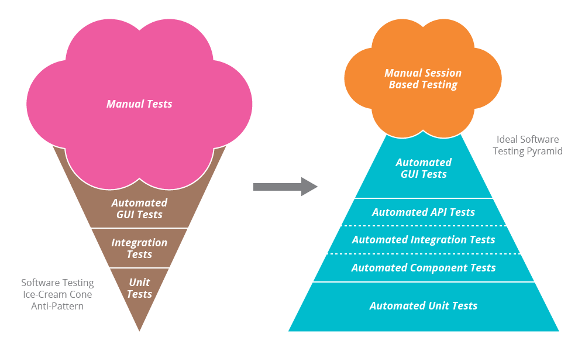
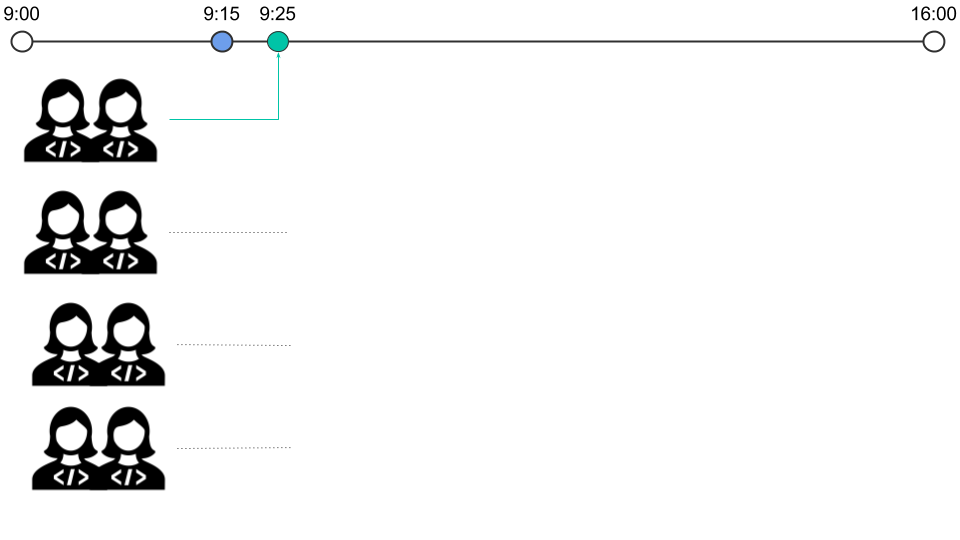

# Integração e Entrega Contínua

----

<h2 class="spaced-text">Como se faz software?</h2>

----

<h3 class="spaced-text" style="text-align:left">Rotina</h3>

  <ul>
    <li> Escrevemos <b class="green">CÓDIGO</b> </li>
    <li> Trabalhamos em <b class="green">TIME</b> </li>
    <li> Cada par trabalha em uma parte</li>
    <li> <b class="green">TESTAMOS</b> nosso código</li>
    <li> O trabalho de cada par precisa  ser <b class="green">INTEGRADO</b> </li>
    <li> Tá consistente? Vai pra aprovação do PO </li>
    <li> PO aprovou? Vai pra <b class="green">PRODUÇÃO</b></li>
  </ul>

----

<h3 class="spaced-text" style="text-align:left">O que é produção?</h3>

----

----

<h3 class="spaced-text" style="text-align:left">ANTIGAMENTE</h3>

  <ul>
    <li> <b class="yellow">FTP</b> </li>
    <li> projeto-backup.old.rar </li>
    <li> projeto-backup1.old.rar </li>
    <li> Alguém tinha que ser o GIT humano </li>
    <li> Alguns testes manuais </li>
    <li> "Vamos pra produção no fim de semana..." </li>
  </ul>

----

<h3 class="spaced-text" style="text-align:left">Evoluindo</h3>

  <ul>
    <li> Versão de controle </li>
    <li> Diferentes tipos de testes </li>
    <li> Testes automatizados </li>
    <li> Automatização de deploys </li>
    <li> Automatização de infraestrutura </li>
  </ul>

----

----

“A integração contínua não elimina os bugs, porém, ela torna drasticamente mais fácil encontrá-los e corrigi-los."

\- Martin Fowler

----

<h3 class="spaced-text" style="text-align:left">Como trabalhar com git?</h3>

----

----

----

----

----

----

----

<h3 class="spaced-text" style="text-align:left">Muito confuso?</h3>

----

<h5 class="spaced-text" style="text-align:left">Integração ruim by Tio Martinho</h5>

----

<h5 class="spaced-text" style="text-align:left">Integração boa by Tio Martinho</h5>

----

<h3 class="spaced-text" style="text-align:left">Links Bacanas</h3>

  <ul>
    <li><a href="https://www.thoughtworks.com/continuous-integration">O que é Integração Contínua?</a></li>
    <li><a href="https://www.thoughtworks.com/continuous-delivery">O que é Entrega Contínua?</a></li>
    <li><a href="https://martinfowler.com/bliki/CanaryRelease.html">Canary Release</a></li>
    <li><a href="https://martinfowler.com/articles/feature-toggles.html">Feature Toggle</a></li>
    <li><a href="https://martinfowler.com/articles/feature-toggles.html">Feature Toggle</a></li>
    <li><a href="https://guides.github.com/introduction/flow/">GitHub Flow com Pull Requests</a></li>
    <li><a href="https://guides.github.com/introduction/flow/https://martinfowler.com/bliki/FeatureBranch.html">Feature Branching e CI</a></li>
  </ul>

----
